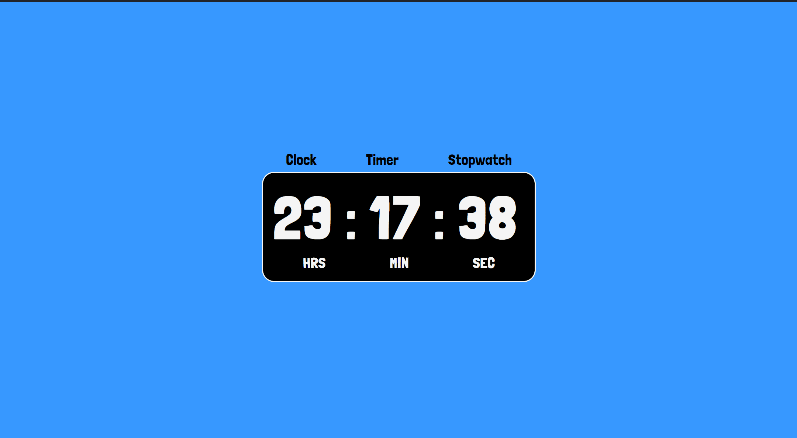
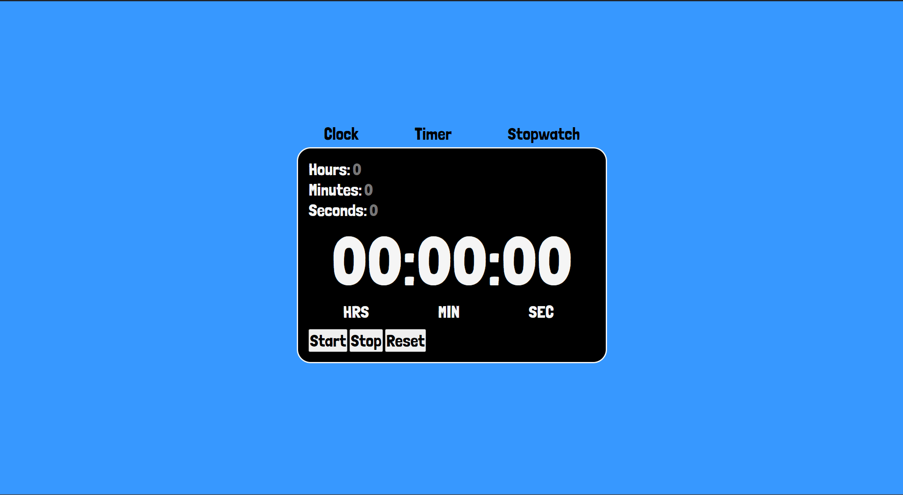

# Clock App

This project is a clock app created using HTML, CSS, and JavaScript. It aims to reinforce conceptual understanding and fortify JavaScript concepts through practical application. The result is a clean and functional website featuring a clock, timer, and stopwatch for enhanced versatility and usability.

## Features

- **Clock:** Displays the current time with hours, minutes, and seconds.
- **Timer:** Allows users to set a countdown timer with customizable time intervals.
- **Stopwatch:** Functions as a stopwatch, enabling users to start, stop, and reset the timer.

## Usage

To use the Clock App:

1. Clone or download the repository to your local machine.
2. Open the `index.html` file in your web browser.
3. Explore the clock, timer, and stopwatch functionalities.

## Screenshots

*Screenshot of the clock*

*Screenshot of the timer*

*Screenshot of the stopwatch*

## Technologies Used

- HTML
- CSS
- JavaScript

## Contributing

Contributions are welcome! If you have any suggestions for improvements or new features, feel free to submit a pull request. For any questions or inquiries, or if you have any comments on this project, please feel free to reach out to me at [here](mailto:aydeshmukh@outlook.com).

## Credits

This project was created by Ashwin.
